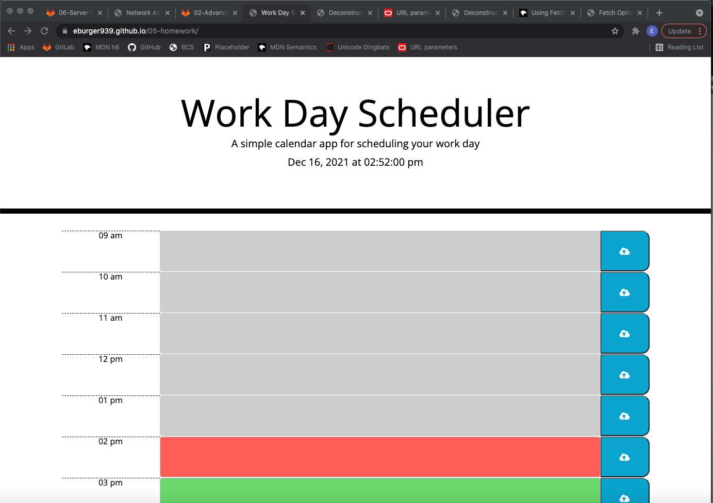

# Homework 5 - day planner
* Due on 12/16/2021
* Worked with Richard, Logan and Ian 

## Description
* Created a day planner that changed colors depending on the time of day (past gray, current red, future green).  The user was able to input appointments on the calender and save the information into the local storage so that when the page is refreshed the data is still visible. 

## Screen shot of final depolyed webpage

## Link to deployed application
* https://eburger939.github.io/day-planner/
